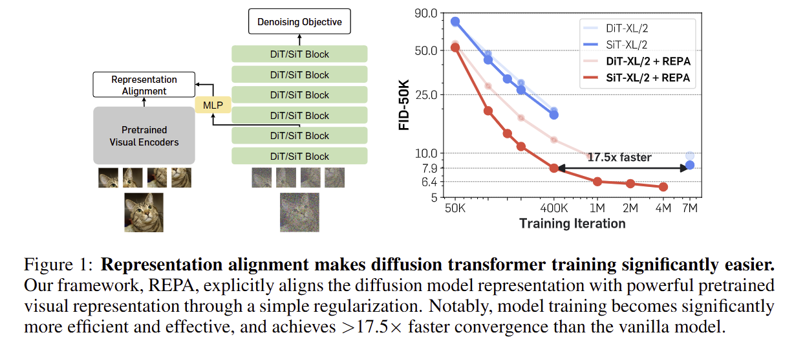

# REPA - Representation Alignment for Diffusion Transformers 

Unofficial PyTorch implementation of ["Representation Alignment for Generation: Training Diffusion Transformers is Easier Than You Think"](https://arxiv.org/abs/2410.06940), with DDP and recitified flow objective.


<p align="center">

</p>

## Installation

```bash
# Clone the repository
git clone https://github.com/cloneofsimo/repa-rf
cd repa

# Create conda environment
conda create -n repa python=3.10
conda activate repa

# Install PyTorch 2.0+ and other dependencies
pip install torch torchvision click transformers diffusers
```

## Getting Started

### Preparing Datasets

We have dataset preparation code for CC12M in preprocessing_script. It will download [cc12m-wds](https://huggingface.co/datasets/pixparse/cc12m-wds) from HuggingFace.

### Training

Basic training command:

```bash
torchrun --nproc_per_node=8 trainer.py \
    --run_name test_run \
    --model_width 512 \
    --learning_rate 1e-4 \
    --dataset_url "path/to/dataset/{0000..2151}.tar" \
    --test_dataset_url "path/to/test/dataset/{2152..2168}.tar" \
    --num_epochs 2 \
    --batch_size 64 \
    --max_steps 5000 \
    --evaluate_every 1000 \
    --alignment_layer 8 \
    --repa_lambda 0.5 \
    --model_depth 9 \
    --model_head_dim 32 \
    --compile_models True
```

Key parameters:
- `model_width`: Width of the transformer model (128, 512, 2048)
- `repa_lambda`: Weight for the REPA loss (0.25-1.0)
- `alignment_layer`: Which layer to apply REPA (typically 8)


## Model Architecture and Components

The codebase includes:

- `model.py`: Core DiT architecture with REPA modifications
- `trainer.py`: Distributed training loop implementation
- `utils.py`: Helper functions and utilities
- `dinov2.py`: DINOv2 model implementation for representation alignment

Key components:
1. DiT/SiT transformer backbone 
2. REPA loss
3. Distributed training support

## Results (from Paper)

| Model | Training Steps | FID↓ | IS↑ |
|-------|---------------|------|------|
| SiT-XL/2 | 7M | 8.3 | 131.7 |
| +REPA | 400K | 7.9 | 122.6 |
| +REPA | 4M | 5.9 | 157.8 |

## Citation

```bibtex
@article{yu2024representation,
  title={Representation Alignment for Generation: Training Diffusion Transformers is Easier Than You Think},
  author={Yu, Sihyun and Kwak, Sangkyung and Jang, Huiwon and Jeong, Jongheon and Huang, Jonathan and Shin, Jinwoo and Xie, Saining},
  journal={arXiv preprint arXiv:2410.06940},
  year={2024}
}
```

## Acknowledgments

This implementation uses code from:
- [DINOv2](https://github.com/facebookresearch/dinov2)

## License

This project is released under the MIT License.